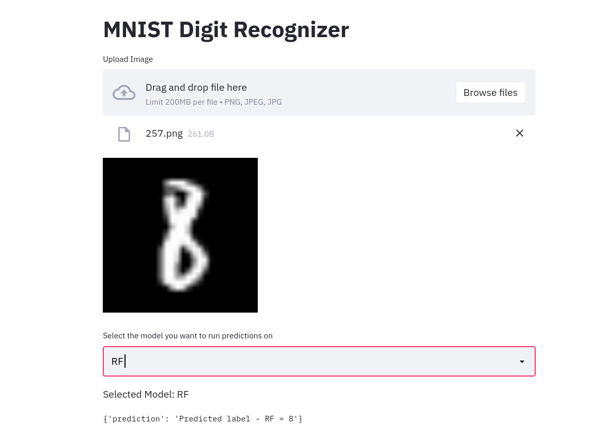
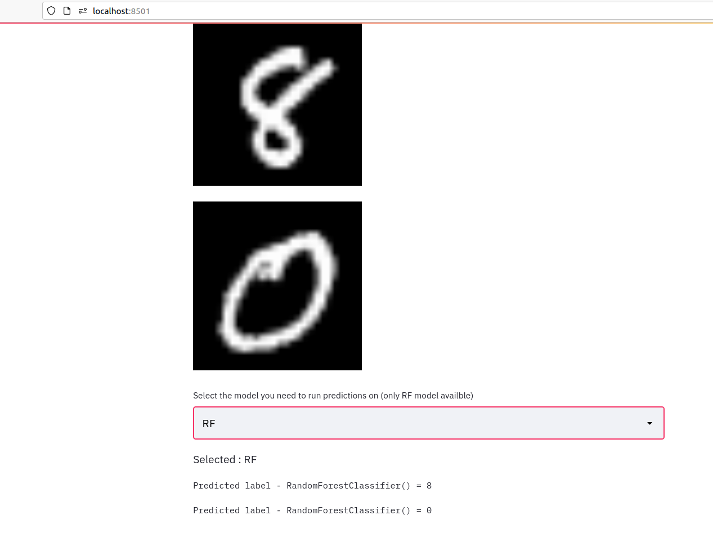

# Digit Recongizer using ML and deep learning models 

A Machine learning webapp build using Streamlit and FAST API to predict the digit of the uploaded image
using ML and Deeplearning models. MLFLOW is used for tracking.

Steps to run

Step1 clone this repo

Step2 pip install requirements

Step3 cd /serving
    to RUN embedded model (zithout FASTAPI)
    run - "streamlit run embedded_model.py"
    
    to RUN API model
    run - "uvicorn main:app --reload"
    run - "streamlit run apimodel.py"

  

  